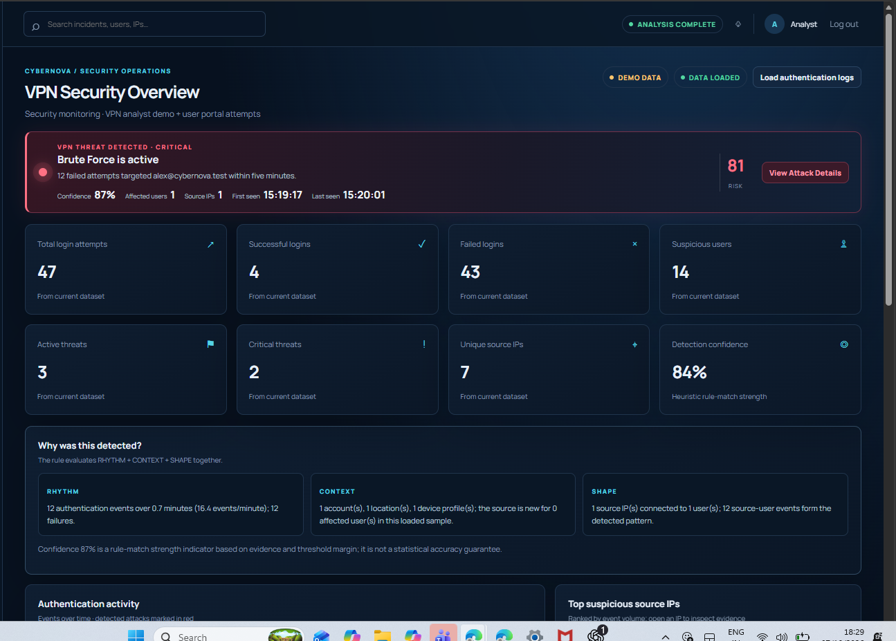

# SprayScope

A browser based VPN authentication threat detection prototype. Analyze authentication events, investigate suspicious activity, and explore simulated VPN attack patterns through a security analyst dashboard.

> **Prototype notice:** SprayScope is a hackathon demo, not production identity or VPN infrastructure. All bundled activity is illustrative.

[](./dashboard-overview.png)

*Select the dashboard image to open it at full size.*

## Explore

| Jump to | What you'll find |
| --- | --- |
| [Quick start](#quick-start) | Run the dashboard and API locally |
| [Dashboard](#dashboard) | Threat detections and analyst views |
| [Project layout](#project-layout) | Frontend, backend, and dataset folders |
| [Datasets](#datasets) | Example authentication logs and ML benchmark |
| [Microsoft sign in](#microsoft-sign-in-setup) | Configure Entra ID for the sign-in button |
| [Limitations](#limitations) | Prototype scope and safe-use notes |
| [Project notes](#project-notes) | Architecture, handoff, and evaluator guides |

## Quick start

Requirements: Node.js 20 or newer.

```powershell
npm start
```

Open [http://localhost:4173](http://localhost:4173). The backend serves the dashboard and API from the same local server. Stop it with **Ctrl+C**.

- [Open the analyst dashboard](http://localhost:4173/)
- [Open the simulated VPN user portal](http://localhost:4173/?portal=1)
- [Check backend health](http://localhost:4173/api/health)

The default analyst sign in is a browser-only demo. It stores local account records and salted PBKDF2 password hashes in the current browser; it is not a production identity store.

## Dashboard

SprayScope analyzes uploaded CSV or JSON authentication events and the bundled simulated stream. It highlights:

- Brute force: 10 failed events for one user in 5 minutes.
- Password spray: 10 users from one source in 10 minutes, with no more than 5 events per user on average.
- Impossible travel: country and centroid based travel estimates.
- Credential stuffing, abnormal login bursts, and account enumeration when rejection details identify unknown usernames.

The overview includes login and threat metrics, event activity, suspicious sources, and a “Why was this detected?” panel that explains rhythm, context, and shape. Confidence is a rule match strength indicator, not measured model accuracy.

The user portal generates simulated login telemetry for training the same detection flow. It does not authenticate a real account or connect to a VPN. Password values are never stored or sent to the API.

## Project layout

| Path | Purpose |
| --- | --- |
| [`frontend/`](frontend/) | Single page dashboard, styles, and browser side modules |
| [`backend/server.js`](backend/server.js) | Node API and static file server |
| [`dataset/`](dataset/) | Small CSV fixtures and optional offline ML training script |
| [`package.json`](package.json) | One command local launcher: `npm start` |

## Datasets

The Dataset page includes labeled fixtures for [brute force](dataset/brute-force-only.csv), [password spray](dataset/password-spray-only.csv), and [impossible travel](dataset/impossible-travel-only.csv), plus a [mixed authentication sample](dataset/demo-authentication.csv). Files are parsed in the browser for analysis.

The optional LANL benchmark script is at [`dataset/scripts/train_lanl.py`](dataset/scripts/train_lanl.py). Install its dependencies with:

```powershell
python -m pip install -r dataset/requirements-ml.txt
```

Place the LANL `auth.txt.gz` and `redteam.txt.gz` source files under `dataset/lanl/`, then run:

```powershell
python dataset/scripts/train_lanl.py
```

The benchmark writes its model and report under `dataset/models/lanl/`. LANL identities are anonymized and the source logs do not include IP addresses or countries, so benchmark metrics do not validate the dashboard's VPN or impossible travel detections.

## Microsoft sign in setup

The Microsoft button uses MSAL Browser with the Microsoft identity platform redirect flow. Register SprayScope as a Single page application in Microsoft Entra ID, add `http://localhost:4173/` as its SPA redirect URI, then put the Application (client) ID in [`frontend/src/authConfig.js`](frontend/src/authConfig.js). The default authority is `common`; for organization only sign in, use that tenant's ID.

Do not put a client secret in this browser application.

## Limitations

This prototype has no analyst account API, VPN control plane, TLS termination, or production grade access controls. Only use synthetic or appropriately sanitized authentication data. Add real identity and VPN integrations and deploy behind HTTPS with suitable access controls before handling real users or authentication traffic.

## Project notes

- [Project architecture, measured fixture metrics, and viva guide](PROJECT_VIVA_GUIDE.md)
- [Five person team handoff and API notes](TEAM_HANDOFF.md)
- [Project overview](SPRAYSCOPE_PROJECT_OVERVIEW.txt)
- [Evaluator questions](SPRAYSCOPE_EVALUATOR_QUESTIONS.txt)
- [What makes SprayScope unique](SPRAYSCOPE_WHATS_UNIQUE.txt)
- [Hackathon source and demo package](SPRAYSCOPE_HACKATHON_PACKAGE.zip)

[Back to top](#sprayscope)

